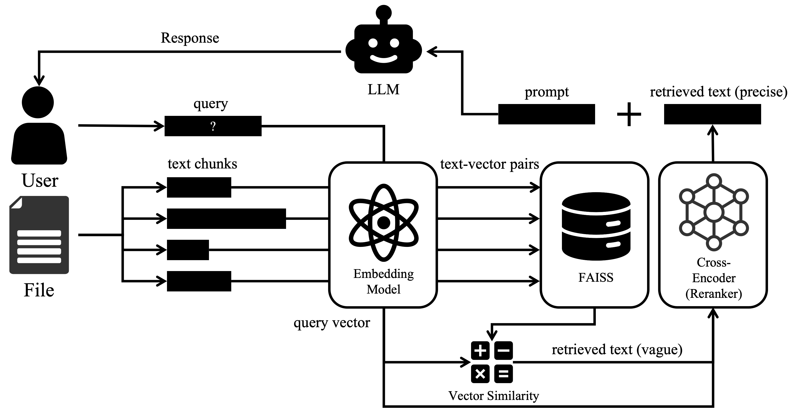

# Simple RAG

Simple RAG implementation.


## Config

- Embedding: BAAI/bge-small-zh-v1.5
- Reranker: BAAI/bge-large-zh-v1.5
- Generator: Qwen2.5-7B-Instruct-1M
- Index: Faiss

# Usage
1. Make sure uv is installed, then run:
```bash
uv sync
```
2. Put the context file in data/context.txt, then run:
```bash
uv run main.py
```